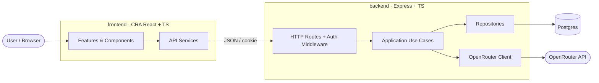
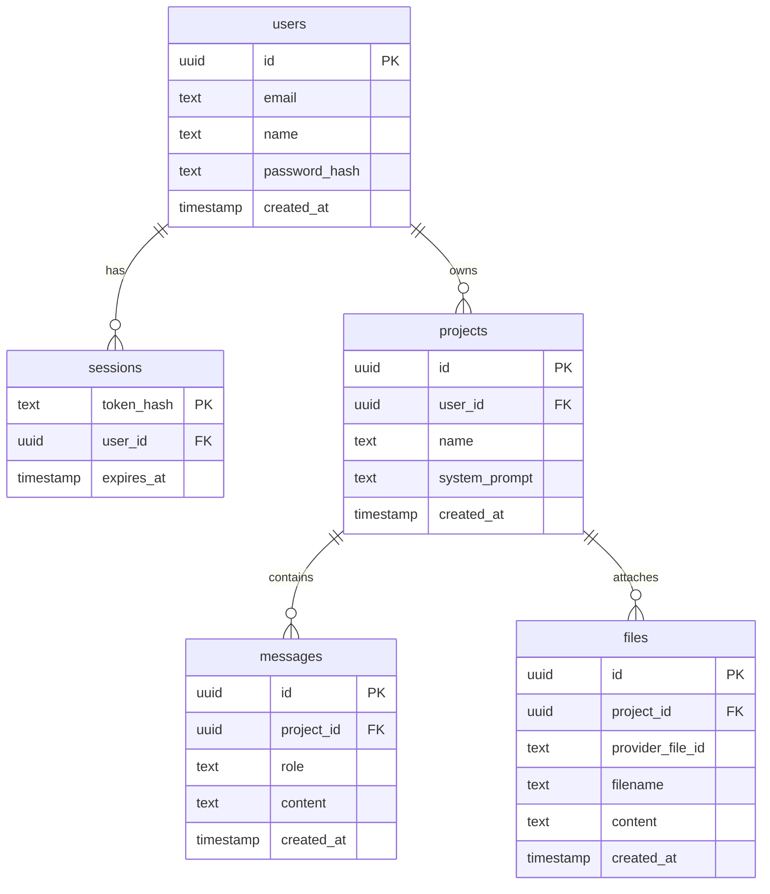
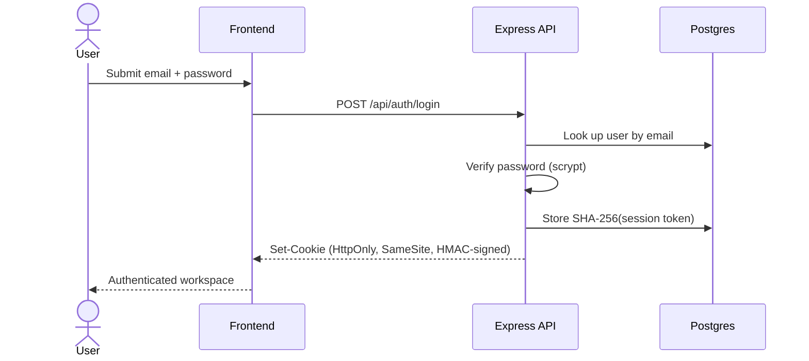
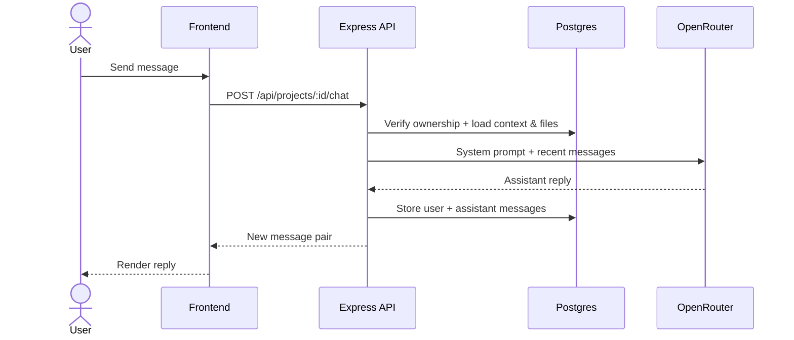

# Architecture

## Overview

YellowClaw is split into two TypeScript workspaces plus a database, keeping browser
code separate from server-only concerns like `OPENROUTER_API_KEY` while staying easy to run.

- **`frontend`** — CRA React TypeScript app for the website UI.
- **`backend`** — Express TypeScript API for auth, persistence, and OpenRouter calls.
- **`postgres`** — relational persistence for users, sessions, projects, messages, and uploaded knowledge files.

## Components

### Backend

| Path | Responsibility |
| ---- | -------------- |
| `src/server.ts` | Express setup, JSON & cookie parsing, CORS, production static serving, error handling |
| `src/domain` | Shared business types and application errors |
| `src/application` | Use cases for auth, projects, chat, files, validation, and serialization |
| `src/infrastructure/auth` | Password hashing, session token signing, cookie helpers, current-user lookup |
| `src/infrastructure/database` | Postgres connection setup |
| `src/infrastructure/repositories` | Postgres repository queries and transactions |
| `src/infrastructure/llm` | OpenRouter chat integration |
| `src/interfaces/http` | Express routes, request typing, auth middleware |
| `src/migrate.ts` | Migration runner; records applied SQL files in `_schema_migrations` |
| `migrations/*.sql` | Ordered schema changes for Postgres |

### Frontend

| Path | Responsibility |
| ---- | -------------- |
| `src/App.tsx` | Thin React composition entrypoint |
| `src/hooks` | Screen orchestration and client-side workflow state |
| `src/services` | Typed API calls grouped by backend capability |
| `src/features` | Auth and workspace UI surfaces |
| `src/components` | Small shared UI components |
| `src/shared` | Frontend-only types and utilities |
| `src/App.css` | Responsive product UI styling |

### Orchestration

| Path | Responsibility |
| ---- | -------------- |
| `docker-compose.yml` | Orchestration for frontend, backend, and Postgres |

## Data Model

## Auth Flow

Passwords are hashed with `scrypt`. A successful login creates a random session token,
stores only its SHA-256 hash in Postgres, signs the browser cookie with HMAC, and sends
it as HttpOnly + SameSite.

## Chat Flow

The React app posts a message to `/api/projects/:id/chat`. The server verifies ownership,
loads recent context plus uploaded knowledge files, calls OpenRouter with the saved prompt,
persists both messages, and returns the new pair.

## File Upload Flow

The React app reads a selected text-like file and posts filename plus content to
`/api/projects/:id/files`. The server stores the file text in Postgres so every future
chat can reuse it as agent context — no dependency on provider-specific file APIs.

## Scalability Path

Postgres handles concurrent reads and writes more safely than the earlier file-based
version. To push further: pooled connection tuning, background cleanup for expired
sessions, streaming chat responses, and richer migration workflows such as rollback
support or drift checks.

## Security Notes

- 🔒 Passwords are never stored in plaintext.
- 🍪 Session cookies are HttpOnly and signed.
- 👤 Every project, message, and file endpoint checks ownership.
- 🔑 API keys are read only from server environment variables.
- 🚫 The OpenRouter key is never exposed to browser JavaScript.
